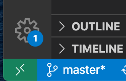
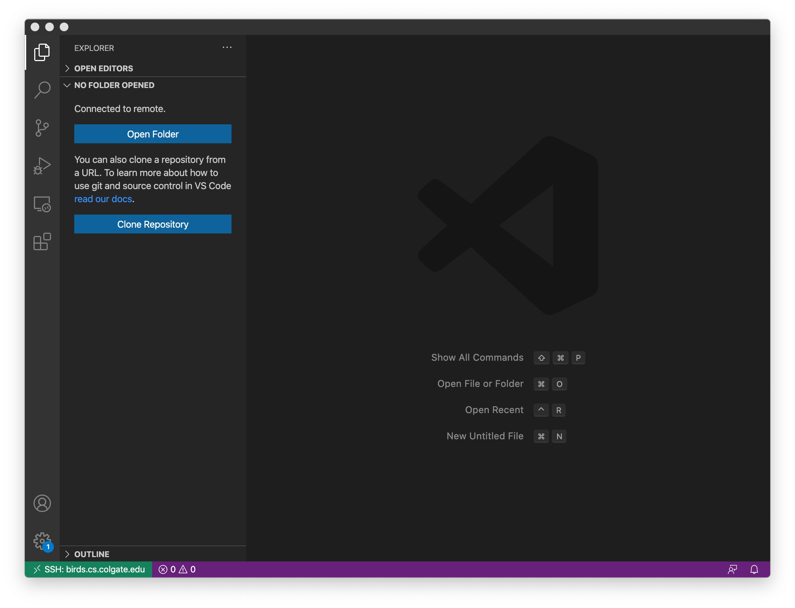

# Lab 01: Development environemnt

## Overview
In this lab, you'll prepare and learn your development environment, which involves the use of secure shell (SSH), VS Code (or Atom), the Linux shell, and git.

### Lab logistics


### Learning objectives
After completing this lab, you should be able to:
* Connect to the computer science department's Linux servers
* Edit files on a remote server using Visual Studio Code (VS Code) or Atom
* Access and manage files using the command line in Linux
* Use git to manage source code files

## Getting started
Before you begin this lab, you must know your CS username and password. 

Your **CS username is your last name plus your first initial**; this is the *inverse* of your Colgate username. For example, if your name were *Ada Lovelace*, then your username would be `lovelacea`. 

If you do not remember your CS account password, then please email the department's system administrator, Val Cucura (`vcucura@colgate.edu`) to request a password reset.

## Part 1: Access a CS department Linux server using SSH
We will be using Linux as the operating system for all our work this semester.  In particular, you will use a pool of department servers which are running Ubuntu 16.04.  We will use the "secure shell" (ssh) program to access the servers.  

### Install SSH (first time)
* On macOS, ssh is already installed.  No need to do anything special.
* On Windows 10, you will need to install the OpenSSH client: [https://docs.microsoft.com/en-us/windows-server/administration/openssh/openssh_install_firstuse]

### Login to the server
1. Connect to the campus wired or wireless (Eduroam) network or connect to campus using VPN. There are [instructions for connecting to the campus VPN](https://www.colgate.edu/about/campus-services-and-resources/vpn-connections-campus-network) if you don't already know how. 
1. Open up a terminal (Terminal program in macOS, powershell or cmd in Windows).
2. Type `ssh USERNAME@birds.cs.colgate.edu` at the terminal prompt, replacing `USERNAME` with your CS username.
3. If this is the first time you've logged in to the servers, you'll get a warning about an ssh key.  You can safely say "yes" to this question.
4. Once the password prompt appears, you should type your CS password (you won't see anything when you type it).
5. You should then see a prompt such as `USERNAME@hawk: $`

## Part 2: Install and configure Visual Studio Code (first time)

I recommend you use the (free) Microsoft Visual Studio Code (VS Code) text editor for your coding work this semester.  If you already have it, great.  If not, go to [https://code.visualstudio.com], download the package for your operating system, and install it.  If you would rather use the (free) Atom text editor, see the alternative part 2 below.  In my experience, VS Code is more stable (i.e., fewer crashes) and faster than Atom.  Also, VS Code has a built-in terminal and many other built-in capabilities that are only available in Atom with extensions.

### Install extensions
Whether or not you already had VS Code installed, you should install three specific extensions:
1. *C/C++* extension pack by Microsoft
2. *Remote Development* extension pack by Microsoft
3. *Live Share Extension Pack* by Microsoft

To install these packages, go to the Extensions panel (click on the four-squares-with-one-misaligned icon on the left, shown in the screenshot below).  You should be able to search for each extension name in the left panel and click Install on the top of the right panel. See [https://code.visualstudio.com/docs/editor/extension-gallery#_browse-for-extensions] for additional help.

### Configure Remote Development extension
The purpose of installing the Remote Development extension is to be able to use VS Code running on your local machine to remotely edit files on the servers. (Pretty cool, eh?) After you've installed the extension, you should click on the opposing arrows icon in the lower-left of your VS Code window, as shown in the screenshot below:



Clicking on that icon will open a command menu.  You should choose `Remote-SSH: Connect to Host...`, then `Add new SSH Host`.  You should fill in the command to be: `ssh USERNAME@birds.cs.colgate.edu -A`, replacing `USERNAME` with your CS username.

Once you've done that, you should click again on the opposing arrows icon, choose `Remote-SSH: Connect to Host...`, then select `birds.cs.colgate.edu`.  A new VS Code window will open, and you'll be prompted to enter your CS password.

Once you've authenticated, you should see a window similar to the following (note that I've clicked on the file icon in the upper left to show the folder view panel on the left-hand side of the window).  You can select to open a particular folder and then open files to edit.  All edits will be done over the ssh connection, to one of the birds servers.  You can also open up an ssh terminal window directly in VS Code by clicking on the + icon on the top bar of the lower panel.  The window below shows a new ssh terminal open on `robin.cs.colgate.edu` (one of the birds servers).  



For additional information and help with the VS Code SSH remote editing capability, you can click on the opposing arrows icon in the lower left, then choose the menu option `Remote-SSH: Help` which should take you to official Microsoft documentation on using this extension.

## Alternative Part 2: Install and configure Atom
If you planning to use VS Code, skip this step and go to Part 3 below. This step is only for students who prefer to use Atom--e.g., because they are already comfortable with the (free) Atom text editor.

### Install add-ons
You should install two add-on packages in Atom:
1. `ftp-remote-edit`
2. `Teletype`

To install a package, go to the Settings page and click on the Install panel.  You can then search for each package named above and install it.  See [Atom documentation](http://flight-manual.atom.io/using-atom/sections/atom-packages/) for more details.

### Configure ftp-remote-edit add-on
The purpose of installing the `ftp-remote-edit` package is to be able to use Atom running on your local host to remotely edit files on the servers.  (Pretty cool, eh?)  After you've installed `ftp-remote-edit`:
1. From the top menu bar, select `Packages → Ftp-Remote → Edit Servers`
2. Enter a password of your own choosing
3. Click the `New` button, and enter the following information into each textbox:
    * The name of the server: `birds`
    * The hostname or IP address of the server: `birds.cs.colgate.edu`
    * Port: `22`
    * Username for authentication: your CS username
    * Password/Passphrase for authentication: your CS password
    * Use sftp (ssh) connection: ✓ check this box
    * Path to private keyfile: don’t enter anything in this text box
    * Initial directory: `/home/cs.colgate.edu/USERNAME` (replacing `USERNAME` with your CS username)
4. Click the Save button. 

To remotely edit files:
1. From the top menu bar, select `Packages → Ftp-Remote-Edit → Toggle`
2. In the Ftp-Remote-Edit sidebar, click the arrow (`>`) next to birds 
3. You should now see the files you have stored in your home directory on the server. 

## Part 3: Prepare to use Github (first time)
Sign up for Github (if you don’t already have an account): [https://github.com/signup/free]

### Configure git
After you’ve created an account, you should customize your git environment on the remote servers you'll be using this semester. SSH to the birds servers using the instructions in Part 1. Then enter the following commands (substituting your own name and email, of course):
```bash
$ git config --global user.name "Aaron Gember-Jacobson"
$ git config --global user.email "agemberjacobson@colgate.edu"
$ git config --global core.editor "nano"
```

In place of nano, you can also use any other text editor of choice. (I'd recommend nano unless you have significant experience in another command-line editor in Linux.)

### Share your GitHub username
Fill-out this form: [https://forms.gle/sSaFT1m8hjfynF9X9] 

## Part 4: Using the Linux shell
Read the following sections of [Learning the Shell](http://linuxcommand.org/lc3_learning_the_shell.php) by William Shott:
* [Navigation](http://linuxcommand.org/lc3_lts0020.php)
* [Manipulating Files](http://linuxcommand.org/lc3_lts0050.php)
* [Working With Commands](http://linuxcommand.org/lc3_lts0060.php)

After you finish reading, do the following:
1. In your home directory, create a `cosc208` directory for this class.
2. Inside your new directory, create a `lab01part4` directory for this lab.
3. Using VS Code, create a new file called `myscript.sh` in your directory for this lab. (To do this, right click on your `lab01` folder in the Explorer panel in VS Code and select `New file`.) In this file, put the commands you just used (one per line) to complete steps 1 and 2. Save and close the file.
4. Back in the shell, rename your file `dirsetup.sh`. 
5. Create a copy of your file, called `file setup.sh` (be sure to include the space in the file name).
6. Using VS Code, edit the `file setup.sh` file. In this file, put the commands you just used (one per line) to complete steps 4 and 5. Save and close the file.

Read the [I/O Redirection](http://linuxcommand.org/lc3_lts0070.php) section of [Learning the Shell](http://linuxcommand.org/lc3_learning_the_shell.php). 

After you’ve finished reading, do the following:
7. Run the `tree` command from your home directory and store its output in a file called `myfiles.log`.
8. Using VS Code, edit the `myfiles.log` file. At the beginning of the file, put the command you just used to complete step 7. Save and close the file.

## Part 5: Using Git
The wrong way to use Git...
 


[https://xkcd.com/1597/] 

### About Git
Read [Section 1.1 Getting Started - About Version Control](https://git-scm.com/book/en/v2/Getting-Started-About-Version-Control) from [Pro Git](https://git-scm.com/book/en/v2) by Scott Chacon and Ben Straub.

### Create and Clone Repo
In this class, we’ll use private repositories held under a GitHub organization. For this lab, you should visit this page to create and obtain access to a private repository containing the starter code for the lab.

After the repository (repo) is created, you should clone your repo in your `~/cosc208/lab01` folder on the Linux servers. If you have never cloned a git repository before, then read [Cloning an Existing Repository](https://git-scm.com/book/en/v2/Git-Basics-Getting-a-Git-Repository#_git_cloning).

### Making Changes
If you have never used Git before, then read [Section 2.2 Git Basics - Recording Changes to the Repository](https://git-scm.com/book/en/v2/Git-Basics-Recording-Changes-to-the-Repository) from [Pro Git](https://git-scm.com/book/en/v2). If you have used Git before, then you can skip most of this reading. However, there are a few useful git commands you may have never used before—`git diff`, `git rm`, and `git mv`—so you should read the relevant paragraphs if you unfamiliar with any of these.

Note: I recommend you always include the `-m` option when you run `git commit`, otherwise git will launch a command-line text editor (nano, by default) for you to enter your commit message. (Entering your commit message in a command-line text editor can be a nuisance, especially if you don’t know how to use such an editor. Although, this semester is an opportune time to learn a command-line text editor like vim or emacs, which is a skill that will likely serve you well in future endeavors.)

After you finish reading, do the following:
1. Use VS Code to put your name at the top of the README.md included in your repo.
2. Commit your updated `README.md` with the commit message `Added name to README`.
3. Copy the `dirsetup.sh`, file `setup.sh`, and `myfiles.log` files from your `~/cosc208/lab01part4/` folder into your git repo clone.
4. Add and commit the files to your git repo with the commit message `Added files from Part 4`.
5. Rename the `file setup.sh` file to `file_setup.sh` (i.e., replace the space with an underscore) and commit the renamed file with the commit message `Spaces in filenames are annoying`. (By this point, you will likely agree with this commit message. It is much easier to work with files and folders on the command line if they use underscores instead of spaces, so using underscores in file and directory names is a good practice to adopt.)

### Undoing Things
Now, read [Section 2.4 Git Basics - Undoing Things](https://git-scm.com/book/en/v2/Git-Basics-Undoing-Things) from [Pro Git](https://git-scm.com/book/en/v2). You should read this even if you have used git before. 

After you finish reading, do the following:
6. Use VS Code to delete the first line of `myfiles.log`.
7. Using the appropriate git command and some I/O redirection, record the uncommitted changes you have made in a file called `edits.log`.
8. Revert the changes you made to `myfiles.log`.
9. Commit the `edits.log` file to your repo.

Pushing and Pulling Changes
“`git push` updates the remote repository with any commits made locally to a branch.”  (from Git Handbook)

“`git pull` updates the local line of development with updates from its remote counterpart. Developers use this command if a teammate has made commits to a branch on a remote, and they would like to reflect those changes in their local environment.” (from Git Handbook)

Now, do the following:
10. Push your commits to GitHub.

After you are all done, you should visit the GitHub page for your repository and view the log and each of the files to confirm you have correctly committed and pushed everything.
